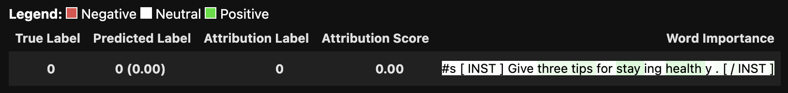

# GiLOT: Interpreting Generative Language Models via Optimal Transport

## Abstract

While large language models (LLMs) surge with the rise of generative AI, algorithms to explain LLMs highly desire. Existing feature attribution methods adequate for discriminative language models like BERT often fail to deliver faithful explanations for LLMs, primarily due to two issues: (1) For every specific prediction, the LLM outputs a probability distribution over the vocabulary–a large number of tokens with unequal semantic distance; (2) As an autoregressive language model, the LLM handles input tokens while generating a sequence of probability distributions of various tokens. To address above two challenges, this work proposes GiLOT that leverages Optimal Transport to measure the distributional change of all possible generated sequences upon the absence of every input token, while taking into account the tokens’ similarity, so as to faithfully estimate feature attribution for LLMs. We have carried out extensive experiments on top of Llama families and their fine-tuned derivatives across various scales to validate the effectiveness of GiLOT for estimating the input attributions. The results show that GiLOT outperforms existing solutions on a number of faithfulness metrics under fair comparison settings.


## Getting Started

There are two main ways to begin:

1. For a simple demonstration, please use the `demo.ipynb` file. Please note that the visualization may not display correctly on GitHub. Refer to the figure below for the expected result. (This demo will be continuously enhanced.)

   

2. To reproduce the results from our paper, please refer to the scripts in the `reproduce/llama_variants` directory.

We welcome you to open issues and engage in discussions with us.

## Citing

If you find this project useful in your research, please consider cite:

```
@inproceedings{
li2024gilot,
title={Gi{LOT}: Interpreting Generative Language Models via Optimal Transport},
author={Xuhong Li and Jiamin Chen and Yekun Chai and Haoyi Xiong},
booktitle={Forty-first International Conference on Machine Learning},
year={2024},
url={https://openreview.net/forum?id=qKL25sGjxL}
}
```
